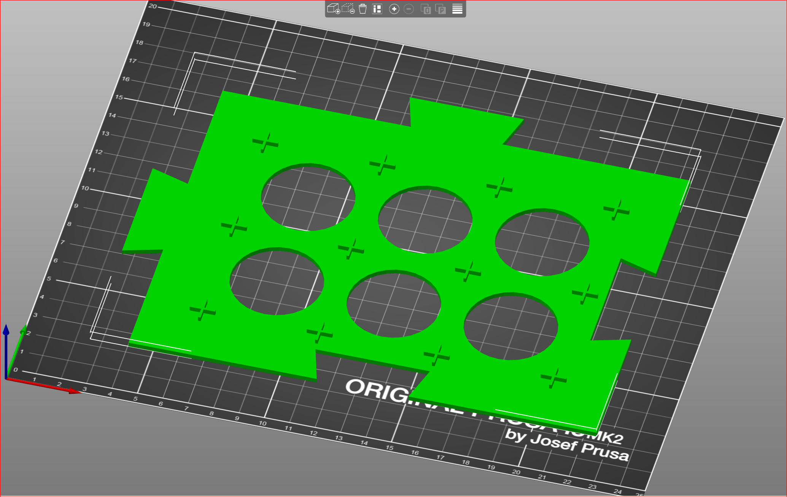

# 3D Prints for Karak board game
3D parametric files for Karak Board game

Included is a pre-exported one-piece rectangular base board that fits in the Karak box.


# Build your own 
To modify parameters use OpenSCAD.

The following variables are tunable and all in mm:
```
tile_size = 45;

cross_width = 10;
cross_thickness = 1;
cross_height = 2;

board_width_mm = 190;
board_height_mm = 230;
board_thickness = 2;
```

The script automatically calculates the number of tiles that fit the desired board dimensions.
